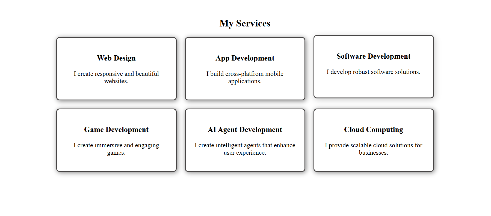

# 🌟 Flexbox Card Layout (Portfolio / Services Section)

A responsive **card layout** built using **HTML5** and **CSS3 Flexbox**.  
This project simulates a portfolio/services section and is part of my web development learning journey.  

---

## 📸 Screenshot

---

## 🛠️ Tech Stack
- **HTML5**
- **CSS3 (Flexbox)**

---

## 📚 What I Learned
- Using Flexbox properties: `display: flex`, `justify-content`, `align-items`, `flex-wrap`, and `gap`  
- Creating responsive card layouts  
- Adding hover effects with `box-shadow`, `transform`, and `transition`  
- Organizing a project structure with HTML, CSS, and assets  

---

## 🚀 Live Demo
👉 [View on GitHub Pages]([https://ninjasyntax.github.io/flexbox-card-layout/](https://github.com/NinjaSyntax/Flexbox-card-layout.git))  

---

## 📂 Project Structure
